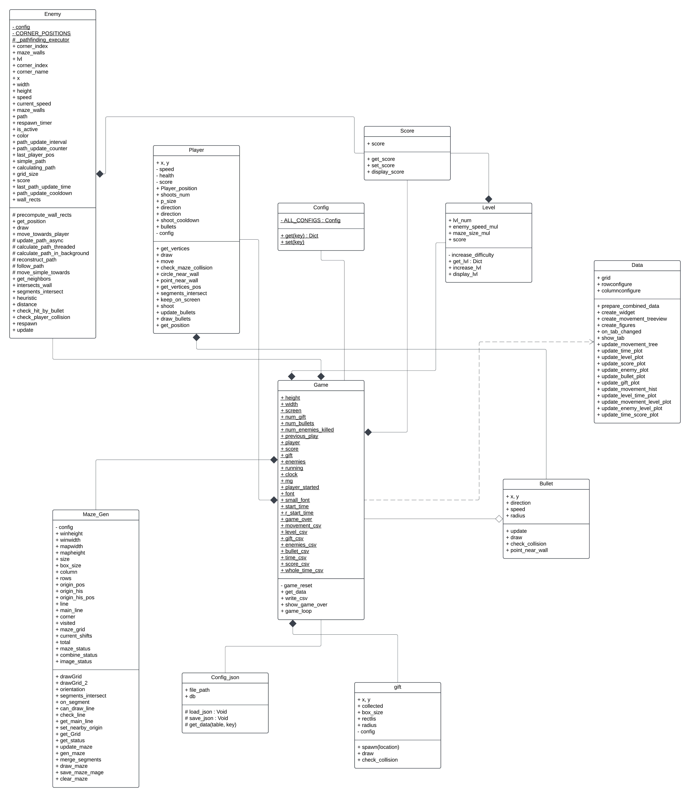

# **Project Overview**

I’d do the maze game, find the path through the maze. The game will have many levels, the difficulty may vary to the level that you got (larger map, limited time) and also has an enemy and score.

Youtube link : <https://youtu.be/PYSMeGPNVys>
# **Project Review**

An existing project is a normal maze game. But mine is I’d use an algorithm to generate a maze map, I’d add the gift (free score) and the enemy to the game.

# **Programming Development**

## Game Concept
This is a maze game where the player find the path to the finished,   
But the game has 4 enemies spawn in each corner and there’s a gift somewhere in the maze.The enemy will come to you and when it touch you, you’re dead, and player have firearm that can shoot the enemy, the firearm will have a 1 second cool down with unlimited ammo and after you shoot some enemy the enemy will respawn in 1 minutes with madness, the speed of these madness enemy is $\times 2$ comparing to that enemy before death. This game also has a score system based on finished time, gift and how many do you kill the enemy. This game also has a level, if you pass you go to the next level, enemy walk faster.

## Object-Oriented Programming Implementation

- Player   
  - Setting how the player look and interact with the game  
- Enemies  
  - Setting how the enemy look and interact with the game  
- Config  
  - Setting in game value e.g. color. This value can be changed but after reopening the game the values will reset to initial value.  
- Config\_json  
  - Setting game value but save the data in json format. This config can be changed in game settings, when the player opens the game next time the previous changes setting is going to be used.  
- Maze\_Gen  
  - Made a maze map  
- Gift  
  - Setting where to place the gift somewhere in the map  
- Level  
  - Setting the level of the game.  
- Game  
  - Run the game  
- Data  
  - Show the statistic data  
- Score  
  - Setting the score of the game  
- Bullet  
  - Draw and update the bullet

## Algorithms Involved
The algorithms that I think it may use in this game are pathfinding(A star) and Origin Shift, where pathfinding(A star) is to find the shortest path to arrive at the player and the Origin Shift is to create the map.

# Statistical Data (Prop Stats)

## Data Features

1. Movement : Track the position that player move e.g. up, down, left right  
2. Time : Track how much time a player spends on each level.  
3. Level : Track how many level player can pass through.  
4. Score : Track how many score player can get when the game ends.  
5. Enemy : Track how many enemies got killed  
6. Gift : Track how many gift that were obtained for each level.  
7. Bullet fired : track how many bullets can kill the enemy.

## Data Recording Method
Those data will be collected in a csv file.

## Data Analysis Report
I’d use the Mode, mean, median, range, IQR in this data and I’d present it in graph.

- Movement graph : to analyze the most direction that player move (histogram)  
- Level and time : to analyze the time that player spend.  
- Movement and level : to analyze that level affect the number of movement  
- Enemy and level : to analyze that level affects the number of killed enemies.  
- Time vs score : to analyze score and time relationship.

# Project Timeline

| Week | Task |
| :---- | :---- |
| 1 (10 March) | Proposal submission / Project initiation |
| 2 (17 March) | Full proposal submission |
| 3 (24 March) | Player should have movement, maze can be generated, interface (Game) should be ready |
| 4 (31 March) | Level included, enemy has been add and can attack player and player can attack enemy, score included |
| 5 (7 April) | Game playable, add setting and starting interface, fixing bug |
| 6 (14 April) | Submission week (Draft) |
| 7 (16 April) | 50% |
| 8 (23 April) | 75% |
| 9 (11 May) | 100% |

# Document version
Version: *4.0*  
Date: *31 March 2025*  

|  | Why it is good to have this data? What can it be used for | How will you obtain 50 values of this feature data? | Which variable (and which class will you collect this from? | How will you display this feature data (via summarization statistics or via graph)? |
| :---- | :---- | :---- | :---- | :---- |
| Movement | It can help to analyze player strategies and navigation pattern  | I’d collect it in json file as a log. 50 value obtainsion can be from 3 \- 4 game depend on player skilled | `Player_position` from `Player` class | summarization. |
| Time | It’s good for observe the difficulty of levels | Record time spent after finishing the level. | `level_time` from `Game` class | histogram |
| Level | Helps track game difficulty progression and player improvement  | Count the highest level that players reached. For 50 rows i have to play 50 game. I’d considered with bot system | `current_level` from `game` class | Bar chart |
| Score | Evaluate player performance  | Final score from 50 complete game, stack the score from each lvl | `player_score` from `game` class | Boxplot  |
| Enemy | Analyze player aggression and enemy AI effectiveness  | Count an enemies killed per lvl | `enemies_killed` from `game` class | Bar chart |
| Gift collected | Determine difficulty of gift colleted | Count gift obtain after Game End | `player_deaths` from `game` class | Pie chart  |
| Bullet fired | Help improve the bullet aiming system, effectiveness of bullet used. | Count the number of times a player shoots their bullets. | `shoots_num` from `Player` | Histogram |

# Statistical Data Revision

|  | Feature Name | Graph objective | Graph type | $x$-axis | $y$-axis |
| :---- | :---- | :---- | :---- | :---- | :---- |
| Graph 1 | Time | observe the difficulty of levels | heatmap | Time | Frequency  |
| Graph 2 | Level | track game difficulty progression and player improvement | Histogram  | level | Count |
| Graph 3 | Score  | Observe central value | Box plot | Score | \- |
| Graph 4 | Enemy | Observe the proportions | Bar chart | Number of killed enemy | Count |
| Graph 5 | Bullet | Observe the proportions | Histogram | Bullets Fired | Count |
| Graph 6 | Gift | Observe the proportions | Pie chart | \- | \- |
| Graph 7 | Movement | Observe the proportions | Bar graph | UP, DOWN, LEFT, RIGHT | Count |
| Graph 8 | Levels vs Time | Observe the proportions | Bar graph | Level | Time |
| Graph 9 | Movement vs Level | Observe the transference | Line graph | Level | Movement |
| Graph 10 | Enemies killed vs Level | Observe the proportion | Bar graph | Level | Enemies killed |
| Graph 11 | Score vs Play time | Observe the change | Scatter plot | time | score |

